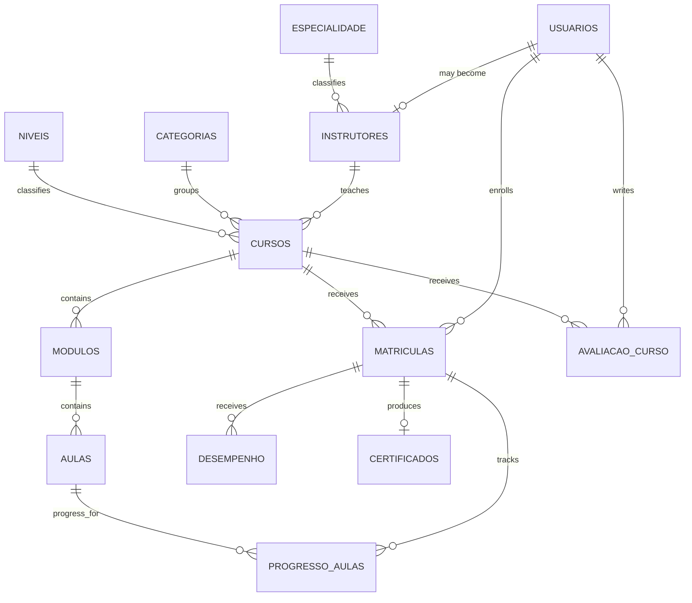

*This project has been created as part of the 42 curriculum by mviana-v.*

# Transcendence — Instituto Consuelo

## Description

Transcendence is an LMS/EduTech web application built for the 42 `ft_transcendence` project. The product is organized around course discovery, accounts and authentication, role-based areas, enrollments, learning progress and course reviews. The final delivery scope also includes the optional modules selected by the team for a total target of 19 module points.

The application follows a browser → HTTPS reverse proxy → frontend/backend → PostgreSQL architecture and is designed to start from a clean clone with Docker Compose.

### Current key features

- public course discovery and course details;
- email/password account registration and login;
- JWT-authenticated application areas;
- student, instructor and administrator roles;
- course categories and levels;
- enrollments and lesson progress;
- course reviews;
- public Privacy Policy and Terms of Service;
- containerized frontend, backend and PostgreSQL;
- HTTPS reverse proxy as the public application entrypoint;
- versioned SQLAlchemy schema managed by Alembic.

Features belonging to the selected 19-point module scope are tracked in GitHub Issues and must only be described as completed here after their implementation and validation are merged.

## Instructions

### Prerequisites

The supported evaluation path requires:

- Docker with Docker Compose v2 support;
- Git;
- a recent stable Google Chrome installation.

Local development outside Docker additionally requires Node.js/npm for the frontend and Python 3.10+ for the backend.

### Environment configuration

Create the local environment file from the versioned template:

```bash
cp .env.example .env
```

The root template currently defines:

```env
POSTGRES_DB=edutech_db
POSTGRES_USER=edutech_user
POSTGRES_PASSWORD=change-me-local-db-password
JWT_SECRET_KEY=change-me-with-a-long-random-secret
```

Replace the example password and JWT secret before using the application. Real secrets must never be committed.

### Run the complete application

From the repository root:

```bash
docker compose up --build
```

The stack starts PostgreSQL, runs Alembic migrations, starts FastAPI and the production frontend, then exposes the application through the HTTPS reverse proxy.

The local evaluation endpoint is:

```text
https://localhost
```

The local reverse proxy generates a self-signed TLS certificate at container startup. Chrome may require the evaluator to acknowledge the local development certificate warning. The private key is generated at runtime and is not committed to Git.

HTTP requests to port 80 are redirected to HTTPS.

### Stop the application

```bash
docker compose down
```

PostgreSQL data is kept in a named volume. To intentionally reset the database:

```bash
docker compose down -v
```

### Clean evaluation run

```bash
git clone <repository-url>
cd transcendece
cp .env.example .env
# replace the example secrets in .env
docker compose up --build
```

No external database account or Supabase project is required for the mandatory local deployment.

### Backend tests

From the backend application environment:

```bash
pytest
```

Specific mandatory checks include password hashing, request validation and multi-user database constraints.

### Frontend checks

From `frontend/`:

```bash
npm ci
npm run lint
npm run build
```

The final evaluation must also be manually checked in the current stable Chrome release with the browser console open.

## Technical Stack

### Frontend

- React 19 — component-based UI framework;
- TypeScript — static typing for browser code and API contracts;
- Vite — frontend build tooling;
- React Router — client-side routing;
- Tailwind CSS — styling and responsive utility system;
- React Hook Form + Zod — form state and validation;
- Axios — HTTP client;
- React Icons — icon set.

React was selected because the existing product is already structured around reusable components and role-specific SPA routes. TypeScript and schema-based form validation reduce contract mistakes between UI and API.

### Backend

- Python 3.10 runtime image;
- FastAPI 0.109 — HTTP API framework and OpenAPI generation;
- Pydantic 2 — request/response validation;
- SQLAlchemy 2 — ORM and transaction/session management;
- Alembic 1.13 — versioned database migrations;
- Passlib PBKDF2-SHA256 — salted password hashing;
- JWT — authenticated API sessions.

FastAPI and Pydantic provide explicit request contracts, while SQLAlchemy/Alembic keep persistence logic and schema evolution versioned and reproducible.

### Database and infrastructure

- PostgreSQL 16;
- Docker / Docker Compose;
- Nginx production static server for the frontend;
- Nginx HTTPS reverse proxy for the public entrypoint.

PostgreSQL is part of the local Compose stack so evaluation does not depend on a team member's external account. Only the reverse proxy publishes application ports in the final architecture.

## Architecture

```text
Browser
   |
   | HTTPS
   v
Reverse Proxy (Nginx)
   |-- /      --> Frontend (React production build)
   |
   `-- /api/  --> FastAPI
                    |
                    v
                PostgreSQL
```

WebSocket upgrades and upload-size configuration are reserved at the reverse-proxy layer for the selected optional modules.

## Database Schema

The active migration line is stored in:

```text
backend/backend/alembic/versions_v2/
```

The old migration directory is retained as development history but is not used by the clean evaluation migration graph.

### Main entities

| Table | Purpose | Important relationships |
| --- | --- | --- |
| `usuarios` | account, authentication and role data | parent of instructor, enrollment and review records |
| `especialidade` | instructor specialties | one-to-many with instructors |
| `instrutores` | instructor profile extension | one-to-one with a user; one-to-many with courses |
| `categorias` | course categories | one-to-many with courses |
| `niveis` | course difficulty levels | one-to-many with courses |
| `cursos` | course metadata | belongs to category, level and instructor |
| `modulos` | ordered course modules | belongs to a course |
| `aulas` | ordered lessons | belongs to a module |
| `matriculas` | student participation in a course | belongs to user and course; unique per student/course |
| `progresso_aulas` | lesson progress | composite key: enrollment + lesson |
| `desempenho` | enrollment assessment data | belongs to an enrollment |
| `avaliacao_curso` | public course review | belongs to user and course; one review per pair |
| `certificados` | completion certificate record | one-to-one with an enrollment |



The migration files and SQLAlchemy models are the source of truth for exact column types and constraints.

## Features List

The table below documents the features currently represented by the repository. Contributors must be updated from real merged Git history as the team completes the project.

| Feature | Function | Verified contributor evidence currently available |
| --- | --- | --- |
| Frontend application structure | React routes, public/authenticated layouts and reusable UI | `mviana-v` / repository baseline; mandatory hardening is AI-assisted under maintainer review |
| Authentication | registration, password hashing, login and JWT access | `mviana-v` / repository baseline; mandatory hardening is AI-assisted under maintainer review |
| Course catalog | course listing/details, categories and levels | `mviana-v` / imported baseline |
| Enrollments/progress | student enrollment and lesson progress | `mviana-v` / imported baseline; concurrency hardening is AI-assisted under maintainer review |
| Course reviews | authenticated student review flow | `mviana-v` / imported baseline; validation hardening is AI-assisted under maintainer review |
| Containerized deployment | frontend/backend/PostgreSQL/reverse proxy | mandatory hardening PR series under `MatheusViuge`, AI-assisted under maintainer review |
| Legal pages | Privacy Policy and Terms of Service | mandatory hardening PR series under `MatheusViuge`, AI-assisted under maintainer review |

This table must be reconciled with the final merged commit/PR history before evaluation. No contributor should be credited for work that cannot be verified.

## Selected Modules — 19 Point Target

The selected final module scope is:

| Module | Size | Points | Target cumulative score |
| --- | --- | ---: | ---: |
| Frontend + backend frameworks | Major | 2 | 2 |
| ORM | Minor | 1 | 3 |
| Custom-made Design System | Minor | 1 | 4 |
| PWA | Minor | 1 | 5 |
| Advanced Search | Minor | 1 | 6 |
| Public API | Major | 2 | 8 |
| Advanced Permissions | Major | 2 | 10 |
| File Upload & Management | Minor | 1 | 11 |
| Standard User Management | Major | 2 | 13 |
| User Interaction | Major | 2 | 15 |
| Real-time WebSockets | Major | 2 | 17 |
| Advanced Analytics Dashboard | Major | 2 | **19** |

The table above describes the selected scope, not automatic proof that a module is complete. A module is only claimed during evaluation after its implementation, tests, README evidence and demo checklist are complete.

Module implementation and contributor details are tracked by the corresponding GitHub Epics and must be copied here when each module reaches its Definition of Done.

## Team Information

### Verified identity from the current Git history

- **mviana-v** — repository author identity associated with the imported project baseline; GitHub account: `MatheusViuge`.

The current `main` history available before the mandatory-hardening PR series contains only one imported baseline commit. Therefore, additional team member identities and responsibilities cannot be truthfully reconstructed from the repository yet. Before final evaluation, every actual team member must have their real 42 login, role and responsibilities added here and backed by real commits/PRs.

### Current responsibility areas

The mandatory-hardening work is organized into:

- frontend/UI and form validation;
- backend/API and authentication security;
- PostgreSQL/SQLAlchemy/Alembic;
- Docker/reverse proxy/HTTPS;
- testing and evaluation documentation.

Final ownership must follow the actual work merged by the team rather than a planned assignment.

## Project Management

GitHub is the source of truth for delivery tracking:

- GitHub Issues describe scope, acceptance criteria and Definition of Done;
- one focused branch/PR is preferred per issue;
- PRs reference their issue and remain draft until the issue can be validated;
- mandatory work is completed before optional-module claims are considered evaluation-ready;
- meaningful commits and actual participation are required from every team member;
- the final clean-clone and evaluation rehearsal blocks delivery if any mandatory requirement or claimed module cannot be reproduced.

The mandatory hardening was initially prepared as a stacked PR series so overlapping files can be reviewed as focused diffs. The stack must be merged in dependency order or retargeted as lower PRs are merged.

## Individual Contributions

### mviana-v / MatheusViuge

Repository evidence currently supports:

- ownership of the imported project baseline commit;
- repository maintenance and integration direction;
- review responsibility for the mandatory-hardening PR stack created under the connected GitHub account.

The mandatory-hardening changes in the current draft PR stack were produced with AI assistance at the maintainer's request. They must be reviewed, tested and merged intentionally by the project team before being considered the maintainer's accepted contribution.

### Additional members

Additional individual contribution entries must be added only after their identity and actual merged work are visible in the repository. Fabricated commits or invented ownership are not acceptable evidence.

## Resources

Primary documentation relevant to the implementation includes:

- React documentation — https://react.dev/
- Vite documentation — https://vite.dev/
- React Router documentation — https://reactrouter.com/
- Tailwind CSS documentation — https://tailwindcss.com/docs
- React Hook Form documentation — https://react-hook-form.com/
- Zod documentation — https://zod.dev/
- FastAPI documentation — https://fastapi.tiangolo.com/
- Pydantic documentation — https://docs.pydantic.dev/
- SQLAlchemy documentation — https://docs.sqlalchemy.org/
- Alembic documentation — https://alembic.sqlalchemy.org/
- PostgreSQL documentation — https://www.postgresql.org/docs/
- Docker Compose documentation — https://docs.docker.com/compose/
- Nginx documentation — https://nginx.org/en/docs/

### AI usage

AI tools have been used as an engineering assistant during the project, including for:

- decomposing the subject into GitHub issues and acceptance criteria;
- reviewing existing code for mandatory-compliance gaps;
- drafting code changes for frontend validation, legal pages, deployment, security and tests;
- identifying race conditions and sensitive-data exposure;
- drafting and reviewing project documentation.

AI-generated or AI-assisted output is not treated as automatically correct. The project team remains responsible for reading the code, testing it, understanding architectural choices, correcting defects and being able to explain every delivered feature during evaluation.

## Evaluation Readiness

Before the project is considered ready:

1. all mandatory issues must be completed and manually validated;
2. `docker compose up --build` must work from a clean clone;
3. Alembic must migrate an empty PostgreSQL database to a single head;
4. signup/login and simultaneous-user scenarios must pass;
5. the current stable Chrome console must be free of relevant application warnings/errors;
6. Privacy Policy and Terms of Service must be publicly accessible;
7. the README must match the final merged implementation and real team history;
8. each claimed optional module must pass its own integration test/demo gate;
9. the selected module score must total exactly 19 points;
10. the final evaluation rehearsal must complete without known blockers.
