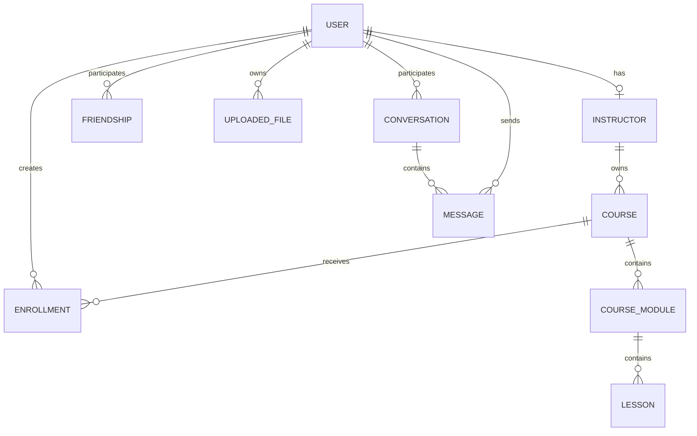

*This project has been created as part of the 42 curriculum by mviana-v, guclemen, lalves-d, gda-conc, jesda-si.*

# Transcendece — EduTech Learning Platform

Transcendece is a full-stack Learning Management System built for the 42 ft_transcendence project. It combines a React frontend, a FastAPI backend, PostgreSQL persistence, HTTPS through Nginx, role-based access control, social features, realtime communication and analytics in a containerized deployment.

The final delivery implements a **19-point module portfolio**: the required 14 module points plus the maximum 5 bonus points.

## Table of Contents

- [Description](#description)
- [Instructions](#instructions)
- [Team Information](#team-information)
- [Project Management](#project-management)
- [Technical Stack](#technical-stack)
- [Architecture](#architecture)
- [Database Schema](#database-schema)
- [Features List](#features-list)
- [Modules](#modules)
- [Individual Contributions](#individual-contributions)
- [Resources and AI](#resources-and-ai)
- [Evaluation Notes](#evaluation-notes)

---

## Description

The platform supports three main application roles: **student**, **instructor** and **administrator**. Users can authenticate securely, browse courses, manage their profile and avatar, interact with friends, use persistent direct chat, receive realtime WebSocket updates and, when authorized, access administrative user management and analytics features.

The application also includes a public API, advanced search, a reusable design system, secure file management, Progressive Web App support, privacy/legal pages and a reproducible Docker-based deployment.

### Main implemented capabilities

- secure registration and JWT authentication;
- salted and hashed passwords;
- frontend and backend input validation;
- public Privacy Policy and Terms of Service;
- HTTPS public entry point through Nginx;
- PostgreSQL persistence managed through SQLAlchemy and Alembic;
- student, instructor and administrator role separation;
- course listing, course details and advanced course search;
- profile editing and public profile pages;
- custom/default avatars;
- friends add/remove/list and presence information;
- persistent direct messaging;
- authenticated WebSocket realtime delivery;
- reconnect and message-gap recovery;
- secure file upload, preview/download and deletion;
- administrative user and role management;
- API-key protected public API with rate limiting and documentation;
- installable PWA with offline behavior;
- reusable custom design system;
- advanced analytics with interactive charts, filters, realtime refresh and CSV/PDF export;
- automated backend, structural, security and complete-deployment smoke tests.

---

## Instructions

### Requirements

- Git;
- Docker Engine;
- Docker Compose (`docker-compose` v1 is supported by the project Makefile);
- GNU Make;
- Google Chrome, latest stable version.

### Environment setup

Create the local environment file:

```bash
make init
```

This copies `.env.example` to `.env` without overwriting an existing file. Before using a non-disposable environment, replace the example database password and JWT secret.

Current required variables are:

```env
POSTGRES_DB=edutech_db
POSTGRES_USER=edutech_user
POSTGRES_PASSWORD=change-me-local-db-password
JWT_SECRET_KEY=change-me-with-a-long-random-secret
```

The real `.env` file is local configuration and must not be committed.

### Start the project

```bash
make up
```

The Makefile validates the Compose configuration, builds the images and starts the complete stack.

Application entry point:

```text
https://localhost
```

The local TLS certificate is generated for the evaluation environment, so the browser may require accepting the local certificate warning.

### Evaluation seed

Populate deterministic evaluation data:

```bash
make seed
```

For a completely clean database and seeded deployment:

```bash
make reset-seed
```

Useful seeded accounts include:

```text
Standard user
alice.ferreira@seed.example.com
SearchSeed42!

Administrator
admin.rbac@seed.example.com
SearchSeed42!
```

### Useful commands

```bash
make ps
make logs
make logs-backend
make logs-frontend
make logs-proxy
make logs-db
make down
make reset
make fclean
```

`make help` prints the complete command list.

---

## Team Information

The roles below describe **final-delivery ownership and evaluation responsibility**. Exact code authorship remains available in the Git history and is not reassigned by this README.

| 42 Login | Project Role(s) | Final delivery responsibility |
|---|---|---|
| `mviana-v` | Product Owner, Project Manager / Scrum Master, Developer | Release coordination, integration, module completion, CI/evaluation readiness and deployment troubleshooting |
| `guclemen` | Technical Lead / Architect, Developer | Architecture ownership for the final delivery, cross-layer integration review and technical presentation |
| `lalves-d` | Developer | Backend, API and database validation ownership for the final evaluation |
| `gda-conc` | Developer | Infrastructure, Docker/Nginx/HTTPS deployment validation and smoke-test ownership |
| `jesda-si` | Developer | Frontend, routing/session UX, responsiveness and final browser validation |

Because the group contains five members, responsibilities are split across the required management, architecture and development functions while every member remains responsible for understanding the complete application.

---

## Project Management

The project was organized through GitHub Issues, Epic issues, branches, pull requests and automated evaluation gates.

Typical flow:

```text
Requirement / module
        ↓
      Issue
        ↓
 Feature branch
        ↓
Implementation + tests
        ↓
 Pull Request
        ↓
CI / deployment smoke
        ↓
Review + integration
        ↓
      main
```

The repository uses separate evaluation evidence and automated gates for important modules. Stacked pull requests were used for dependent modules such as User Interaction, WebSockets and Analytics so each module could remain reviewable without mixing unrelated diffs.

Final validation is performed against the integrated `main` branch using the same Docker deployment path used during evaluation.

---

## Technical Stack

### Frontend

| Technology | Purpose |
|---|---|
| React 19 | Main frontend framework |
| TypeScript | Static typing and frontend contracts |
| Vite | Development and production build tooling |
| Tailwind CSS | Responsive styling and design tokens |
| React Router | Client-side routing |
| Axios | HTTP communication |
| React Hook Form | Form management |
| Zod | Frontend validation |
| React Icons | Shared icon set |

### Backend

| Technology | Purpose |
|---|---|
| FastAPI | HTTP and WebSocket backend framework |
| Python 3.10 | Backend language/runtime |
| SQLAlchemy | ORM and relational persistence |
| Alembic | Versioned database migrations |
| Pydantic | Request/response validation |
| JWT | Authentication/session tokens |
| Passlib | Password hashing support |
| Uvicorn | ASGI application server |
| Pytest | Backend automated testing |

### Infrastructure

| Technology | Purpose |
|---|---|
| PostgreSQL 16 | Relational database |
| Docker / Docker Compose | Reproducible service orchestration |
| Nginx | HTTPS reverse proxy and frontend runtime |
| GitHub Actions | CI, security checks and deployment smoke tests |

---

## Architecture

```text
                         HTTPS / WSS
Browser  ─────────────────────────────────────┐
                                              ▼
                                      ┌───────────────┐
                                      │     Nginx     │
                                      │ reverse proxy │
                                      └───────┬───────┘
                                   /          │          /api/
                                  ▼           │             ▼
                         ┌──────────────┐      │      ┌──────────────┐
                         │   React SPA  │      │      │   FastAPI    │
                         │ static build │      │      │ REST + WS    │
                         └──────────────┘      │      └──────┬───────┘
                                              │             │
                                              │             ▼
                                              │      ┌──────────────┐
                                              └─────▶│  PostgreSQL  │
                                                     └──────────────┘
```

The browser communicates externally only through the HTTPS/WSS entry point. REST endpoints remain the persistence/source-of-truth path, while WebSockets are used for immediate realtime delivery.

---

## Database Schema

The application uses PostgreSQL with SQLAlchemy models and Alembic migrations. The schema is relational and uses foreign keys, unique constraints and validation constraints to protect application invariants.

### Main relationships



### Important schema guarantees

- user email uniqueness;
- password hashes are stored instead of plaintext passwords;
- role and active-state constraints are enforced server-side;
- friendships use canonical user pairs so the same friendship cannot be duplicated in reverse order;
- direct conversations use canonical participant pairs for the same reason;
- messages belong to a persisted conversation and sender;
- uploaded files retain owner metadata and are protected by access checks;
- enrollment/course relationships are protected against duplicate pairs;
- migrations are automatically applied before the backend starts.

---

## Features List

All items below are integrated in the final `main` branch. Exact commit-level authorship can be inspected in Git; the full team owns the final integrated behavior and evaluation.

| Feature | Status | Description | Contributor(s) |
|---|---|---|---|
| Registration and authentication | Implemented | Validated signup/login, JWT sessions and protected routes | Team |
| Privacy Policy / Terms | Implemented | Public project-specific legal pages | Team |
| Course catalog/details | Implemented | Real database-backed course browsing and detail pages | Team |
| Advanced Search | Implemented | Server-side query, filters, sorting and pagination with URL-synced UI | Team |
| Framework architecture | Implemented | React frontend + FastAPI backend | Team |
| ORM and migrations | Implemented | SQLAlchemy persistence + Alembic migration chain | Team |
| Design System | Implemented | Shared palette, typography, icons and reusable components | Team |
| Progressive Web App | Implemented | Manifest, service worker, installability and offline UX | Team |
| Public API | Implemented | Versioned API, API keys, rate limiting, docs and CRUD-style endpoints | Team |
| Advanced Permissions | Implemented | User CRUD, role management and permission-aware views/actions | Team |
| File Upload & Management | Implemented | Multi-type validation, ownership, persistence, preview/progress and delete | Team |
| Standard User Management | Implemented | Editable profile, avatar, friends, presence and public profiles | Team |
| User Interaction | Implemented | Persistent private direct chat integrated with profiles/friends | Team |
| WebSocket Realtime | Implemented | Authenticated WSS, scoped broadcasting, reconnect and gap recovery | Team |
| Analytics Dashboard | Implemented | KPIs, charts, date/filter controls, realtime updates and CSV/PDF exports | Team |
| Evaluation/CI gates | Implemented | Structural, security, backend and full HTTPS/WSS deployment checks | Team |

---

## Modules

The module portfolio totals **19 points**.

| Module | Type | Points | Implementation summary | Status |
|---|---:|---:|---|---|
| Frontend + Backend Framework | Major | 2 | React + FastAPI as the application architecture | Implemented |
| ORM | Minor | 1 | SQLAlchemy + Alembic | Implemented |
| Custom Design System | Minor | 1 | Semantic visual foundations and 10+ reusable components | Implemented |
| Progressive Web App | Minor | 1 | Installable manifest, service worker and offline behavior | Implemented |
| Advanced Search | Minor | 1 | Search, filters, sorting and pagination | Implemented |
| Public API | Major | 2 | API-key security, rate limiting, docs and multiple HTTP methods/endpoints | Implemented |
| Advanced Permissions | Major | 2 | User CRUD, role administration and RBAC-enforced actions/views | Implemented |
| File Upload & Management | Minor | 1 | Secure multi-type upload lifecycle and ownership controls | Implemented |
| Standard User Management | Major | 2 | Profile, avatar, friends, presence and public profiles | Implemented |
| User Interaction | Major | 2 | Basic chat integrated with profiles and friend flows | Implemented |
| Real-time WebSockets | Major | 2 | Authenticated realtime connection and scoped live broadcasting | Implemented |
| Advanced Analytics Dashboard | Major | 2 | Interactive analytics, realtime data, filters and exports | Implemented |
| **TOTAL** |  | **19** | Required 14 points + maximum 5 bonus points | **Implemented** |

### Module evidence

Evaluation-oriented documentation, structural checks, security checks and deployment smoke scripts are stored under `docs/evaluation/`, `scripts/` and `.github/workflows/`.

Important completed integration PRs include:

- Standard User Management — PR #125;
- User Interaction — PR #126;
- WebSockets — PR #128;
- Advanced Analytics Dashboard — PR #129;
- final course-data/deployment compatibility hotfix — PR #130.

---

## Individual Contributions

The project history contains collaborative development and integration work across multiple branches. This section records verifiable work where available and the final area each member owns for evaluation. It intentionally does not rewrite Git authorship.

### `mviana-v`

**Roles:** Product Owner, Project Manager / Scrum Master, Developer.

Primary final responsibilities include integration of the module roadmap, release/evaluation readiness, CI gates, Docker/Compose compatibility, Makefile tooling, seed/evaluation workflow, cross-module debugging and final pull-request integration.

A recurring challenge was making the same complete deployment behave consistently in GitHub Actions and the 42 environment. The final tooling supports the local Compose v1 environment while CI-specific scripts remain compatible with Compose v2 where required.

### `guclemen`

**Roles:** Technical Lead / Architect, Developer.

Final ownership covers architectural understanding and validation of the React/FastAPI/PostgreSQL boundaries, module integration, API contracts and the technical explanation of the system during evaluation.

The main evaluation responsibility is demonstrating why persistence remains authoritative through REST/PostgreSQL while realtime delivery, role controls and client state remain separate concerns.

### `lalves-d`

**Role:** Developer.

Final ownership covers backend/API/database validation: authentication flows, relational constraints, migrations, public API behavior, RBAC checks and regression-test interpretation.

The main evaluation responsibility is validating that access control and data integrity are enforced by the backend/database rather than only by frontend visibility rules.

### `gda-conc`

**Role:** Developer.

Final ownership covers infrastructure and deployment validation: Docker/Compose lifecycle, Nginx HTTPS/WSS routing, persistence volumes, service health and complete-stack smoke testing.

The main evaluation responsibility is reproducing a clean deployment and explaining how frontend, backend, proxy and PostgreSQL services interact.

### `jesda-si`

**Role:** Developer.

Final ownership covers frontend/session UX, routing and browser validation. Repository history includes the fix to preserve the authenticated route correctly while user state reloads, preventing the page reload flow from being incorrectly blocked by the loading state.

The main evaluation responsibility is checking responsive behavior, protected navigation, logout/login identity changes and end-user interaction flows in Chrome.

---

## Resources and AI

Main technical references used during development include the official documentation for React, FastAPI, SQLAlchemy, Alembic, PostgreSQL, Docker, Nginx, WebSockets, TypeScript and the 42 ft_transcendence subject.

AI tools were used as development support for debugging, implementation suggestions, test design and documentation drafting. Suggestions were reviewed, adapted and validated through local testing, code review and CI before integration; final technical decisions and project responsibility remained with the team.

---

## Evaluation Notes

Recommended clean evaluation flow:

```bash
git clone https://github.com/MatheusViuge/transcendece.git
cd transcendece
make init
# adjust .env values if desired
make reset-seed
make ps
```

Then open:

```text
https://localhost
```

For module-specific evidence, use the documentation and scripts under:

```text
docs/evaluation/
scripts/
.github/workflows/
```

The final integrated branch is `main` and the project is intended to be evaluated from a clean Docker deployment using the provided Makefile workflow.
