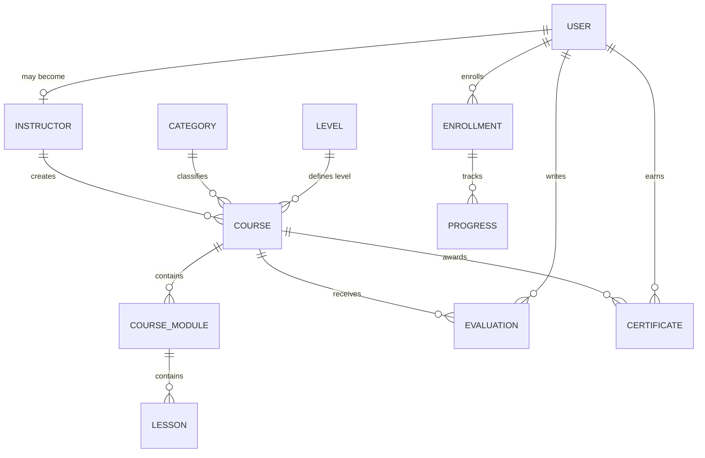

*This project has been created as part of the 42 curriculum by mviana-v.*

# Transcendece — EduTech Learning Platform

> **README status:** delivery skeleton aligned with the ft_transcendence v21.2 subject. Sections marked with `TODO` must be completed with final, verifiable project information before evaluation.

## Table of Contents

- [Description](#description)
- [Instructions](#instructions)
- [Team Information](#team-information)
- [Project Management](#project-management)
- [Technical Stack](#technical-stack)
- [Architecture](#architecture)
- [Database Schema](#database-schema)
- [Features List](#features-list)
- [Modules](#modules)
- [Individual Contributions](#individual-contributions)
- [Resources](#resources)
- [Known Limitations and Final Evaluation Checklist](#known-limitations-and-final-evaluation-checklist)

---

## Description

### Project name

**Transcendece — EduTech Learning Platform**

### Goal

Transcendece is a web-based Learning Management System (LMS) developed as part of the 42 curriculum. The platform is designed around three main types of users — students, instructors, and administrators — and aims to provide a complete environment for publishing courses, consuming educational content, tracking learning progress, managing users, and enabling social and real-time interactions.

The final delivery is planned around the mandatory ft_transcendence requirements plus a **19-point module portfolio**.

### Key features

The final product is planned to include:

- secure account registration and authentication;
- role-based user experiences for students, instructors, and administrators;
- course discovery, enrollment, lessons, progress tracking, evaluations, and certificates;
- responsive and accessible web interfaces;
- public Privacy Policy and Terms of Service pages;
- advanced course search with filters, sorting, and pagination;
- user profiles, avatars, friends, and presence information;
- direct user interaction and chat;
- real-time updates through WebSockets;
- secure file upload and management;
- a documented public API protected by API keys and rate limiting;
- advanced role and permission management;
- an installable Progressive Web App with offline behavior;
- an advanced analytics dashboard with filters and CSV/PDF exports;
- a reusable custom design system;
- containerized deployment through a single command.

> The list above describes the target delivery. The [Features List](#features-list) must be kept synchronized with what is actually merged and demonstrable.

---

## Instructions

### Prerequisites

Final evaluation is expected to require:

- Git;
- Docker Engine or an equivalent container runtime;
- Docker Compose v2 or an equivalent orchestration command;
- Google Chrome, latest stable version;
- a local `.env` file created from `.env.example`.

For local development outside containers, the repository currently uses:

- Node.js / npm for the frontend;
- Python 3.10+ for the backend;
- PostgreSQL as the target relational database.

### Environment configuration

The final repository must provide a root `.env.example` with every required configuration key and no real secrets.

Expected configuration includes values equivalent to:

```env
POSTGRES_DB=transcendence
POSTGRES_USER=transcendence
POSTGRES_PASSWORD=change_me
DATABASE_URL=postgresql+psycopg2://transcendence:change_me@db:5432/transcendence
JWT_SECRET_KEY=change_me_with_a_long_random_value
```

Additional environment variables must be documented here when new modules require them.

### Final evaluation startup flow

The target deployment flow is:

```bash
git clone <repository-url>
cd transcendece
cp .env.example .env
# Replace example secrets in .env
docker compose up --build
```

The final application is expected to be exposed through HTTPS by the reverse proxy.

> **TODO before evaluation:** confirm the exact host/port, certificate setup, shutdown command, persistence behavior, and clean-install procedure against the final deployment branch.

### Frontend development

```bash
cd frontend
npm ci
npm run dev
```

Useful checks:

```bash
npm run lint
npm run build
```

### Backend development

```bash
cd backend
python -m venv .venv
source .venv/bin/activate
pip install -r requirements.txt
```

The backend is built with FastAPI and is expected to use Alembic as the authoritative database migration mechanism.

> **TODO before evaluation:** document the exact local backend startup and Alembic commands used by the final branch.

---

## Team Information

Every team member listed in the first line of this README must appear in this section with their real 42 login, role, and responsibilities.

| 42 Login | Project Role(s) | Responsibilities |
|---|---|---|
| `mviana-v` | TODO: confirm final role(s) | TODO: replace with the final, verifiable responsibility summary based on merged work |
| TODO | TODO | TODO |
| TODO | TODO | TODO |

### Required final review

Before evaluation:

- add every actual team member to the first line of the README;
- remove unused placeholder rows;
- make roles match the way the team actually worked;
- ensure responsibilities can be explained and supported by commits, issues, and pull requests.

---

## Project Management

### Work organization

The project is organized around GitHub Issues and Pull Requests. Work is broken into mandatory-compliance tasks, module Epics, implementation issues, testing tasks, and evaluation-readiness gates.

Planned workflow:

```text
Issue
  ↓
Branch
  ↓
Implementation + tests
  ↓
Pull Request
  ↓
Review
  ↓
Integration testing
  ↓
Merge
```

### Project management tools

- GitHub Issues — backlog and task tracking;
- GitHub Pull Requests — review and integration;
- Git branches — isolated implementation;
- TODO: document any additional board/project-management tool actually used by the team.

### Meetings and task distribution

TODO: describe the real meeting cadence, planning process, ownership decisions, and how blockers were handled.

### Communication channels

TODO: document the actual communication channels used by the team (for example Discord, Slack, WhatsApp, in-person meetings, or another channel).

---

## Technical Stack

### Frontend

| Technology | Purpose |
|---|---|
| React 19 | Component-based frontend framework |
| TypeScript | Static typing and safer frontend contracts |
| Vite | Frontend development and production build tooling |
| Tailwind CSS | Utility-first styling and responsive layouts |
| React Router | Client-side routing |
| Axios | HTTP client for backend communication |
| React Hook Form | Form state and submission management |
| Zod | Frontend schema validation |
| React Icons | Consistent icon library |

### Backend

| Technology | Purpose |
|---|---|
| FastAPI | Backend web framework and HTTP API |
| Python | Backend application language |
| SQLAlchemy | ORM and relational data access |
| Alembic | Database schema migrations |
| Pydantic | Request/response validation and data contracts |
| Passlib | Password hashing support |
| JWT libraries | Session/authentication tokens |
| Uvicorn | ASGI application server |
| Pytest | Automated backend tests |

### Database

**PostgreSQL** is the target relational database.

It was selected because the platform has strongly related entities such as users, instructors, courses, lessons, enrollments, progress, evaluations, friendships, messages, and permissions. PostgreSQL provides transactional consistency, relational constraints, indexing, concurrency support, and mature integration with SQLAlchemy and Alembic.

### Deployment and infrastructure

Planned final infrastructure:

- Docker containers;
- Docker Compose orchestration;
- Nginx or equivalent reverse proxy;
- HTTPS/TLS at the public entry point;
- PostgreSQL named-volume persistence;
- environment-based secret configuration.

### Major technical choices

#### React + FastAPI

The combination separates the user interface from backend domain logic while keeping a clear API contract between the two sides. It also directly supports the selected **Framework** Major module.

#### SQLAlchemy + Alembic

SQLAlchemy provides ORM-based persistence while Alembic provides explicit, reproducible schema evolution. Together they support the selected **ORM** Minor module and make clean deployments easier to validate.

#### PostgreSQL

PostgreSQL is appropriate for a multi-user educational platform because correctness and relational integrity matter for enrollments, permissions, progress, messages, and analytics.

#### Docker Compose

Container orchestration makes the project reproducible for peers and evaluators and supports the mandatory requirement that the project can be started with a single command.

---

## Architecture

Target deployment architecture:

```text
Browser
   │
   │ HTTPS
   ▼
Reverse Proxy
   ├── / --------------------> Frontend
   │                            React / static production build
   │
   └── /api/ ----------------> Backend
                                FastAPI
                                  │
                                  ▼
                              PostgreSQL
```

Real-time features will extend the same public HTTPS entry point with WebSocket upgrade support.

> **TODO before evaluation:** update this diagram if the final architecture differs from the target shown above.

---

## Database Schema

The current product domain already contains relational concepts for users, instructors, courses, lessons, enrollments, learning progress, evaluations, assessments, categories, levels, modules, specialties, and certificates.

The final schema is expected to evolve with the selected social, upload, permissions, real-time, and analytics modules.

### Core domain overview



### Expected core tables

| Entity | Purpose | Important fields to document in final README |
|---|---|---|
| User | Account and authentication data | id, name, email, password hash, role, timestamps |
| Instructor | Instructor-specific profile data | user reference, biography/specialty-related data |
| Course | Course metadata and ownership | id, title, description, instructor, category, level, status |
| Course Module | Groups lessons inside a course | id, course reference, title, ordering |
| Lesson | Educational unit | id, module reference, title, content/type, ordering |
| Enrollment | Student-course relationship | student, course, status, timestamps |
| Progress | Lesson/course learning progress | enrollment/student references, completion/progress data |
| Evaluation | Course review/rating | user, course, rating, comment |
| Assessment | Assessment-related data | TODO: document final fields and relationships |
| Certificate | Course completion certificate | user, course, issue metadata |
| Category | Course classification | id, name |
| Level | Course difficulty level | id, name |
| Specialty | Instructor specialization | TODO: document final relationship |

### Planned module-related schema additions

The selected modules may require additional entities such as:

- friendship / friend request;
- chat conversation and message;
- file/upload metadata;
- API key and API usage/rate-limit data;
- role/permission records when not represented only by static roles;
- analytics/event aggregates.

> **TODO before evaluation:** replace this planning-oriented schema section with the final migration-backed schema, including real table names, key types, foreign keys, unique constraints, and module-specific tables.

---

## Features List

The subject requires a complete list of implemented features, the team member(s) responsible for each feature, and a short explanation.

The table below starts as a delivery roadmap. **Change each status only when the feature is merged, tested, and demonstrable.**

| Feature | Status | Description | Contributor(s) |
|---|---|---|---|
| Account registration | TODO verify | Secure user registration with validated input | TODO |
| Login / JWT authentication | TODO verify | Authenticated sessions and protected routes | TODO |
| Role-based application areas | TODO verify | Student, instructor, and administrator experiences | TODO |
| Course catalog | TODO verify | Browse and inspect available courses | TODO |
| Enrollment | TODO verify | Students enroll in courses | TODO |
| Lessons and modules | TODO verify | Course content hierarchy | TODO |
| Learning progress | TODO verify | Track student completion/progress | TODO |
| Evaluations/reviews | TODO verify | Users review courses | TODO |
| Certificates | TODO verify | Course completion certificate flow | TODO |
| Privacy Policy | Planned/mandatory | Public project-specific privacy information | TODO |
| Terms of Service | Planned/mandatory | Public project-specific usage terms | TODO |
| Advanced Search | Planned module | Search, filters, sorting, pagination, URL state | TODO |
| Public API | Planned module | API-key secured CRUD-style API with rate limiting and docs | TODO |
| Advanced Permissions | Planned module | User CRUD, role management, protected actions/views | TODO |
| File Upload & Management | Planned module | Validated upload, preview/progress, secure access and delete | TODO |
| User Profiles | Implemented in PR #125 | Editable profiles, avatars/default avatars | TODO final attribution |
| Friends and presence | Implemented in PR #125 | Friends add/remove/list plus timeout-based online/offline status | TODO final attribution |
| Chat | Implemented in PR #126 (pending review) | Persistent direct messaging, private history pagination and profile/friend integration | TODO final attribution |
| Real-time updates | Planned module | WebSocket-based live updates and broadcasting | TODO |
| PWA | Planned module | Installability and offline behavior | TODO |
| Design System | Planned module | Reusable documented visual/component system | TODO |
| Analytics Dashboard | Planned module | Charts, filters, real-time data, CSV/PDF exports | TODO |

---

## Modules

### Point system

According to the ft_transcendence module system:

- **Major module = 2 points**;
- **Minor module = 1 point**.

The project requires at least **14 validated module points**. The current roadmap targets **19 points**, which corresponds to the required module target plus up to 5 additional bonus points, subject to evaluation and full module validation.

### Planned module portfolio — target: 19 points

| Module | Type | Points | Planned implementation | Contributor(s) | Status |
|---|---:|---:|---|---|---|
| Frontend + Backend Framework | Major | 2 | React frontend and FastAPI backend as the primary application frameworks | TODO | Planned / foundation exists |
| ORM | Minor | 1 | SQLAlchemy models with Alembic-managed migrations | TODO | Planned / foundation exists |
| Custom Design System | Minor | 1 | Defined palette, typography, icons and at least 10 reusable documented components | TODO | Planned |
| Progressive Web App | Minor | 1 | Manifest, service worker, installability, offline fallback and cache strategy | TODO | Planned |
| Advanced Search | Minor | 1 | Search with filters, sorting, pagination and synchronized frontend query state | TODO | Planned |
| Public API | Major | 2 | Secured API keys, rate limiting, documentation and at least five GET/POST/PUT/DELETE endpoints | TODO | Planned |
| Advanced Permissions | Major | 2 | User CRUD, role management and role-based backend/frontend actions | TODO | Planned |
| File Upload & Management | Minor | 1 | Multi-type uploads with type/size validation, secure storage, preview, progress and deletion | TODO | Planned |
| Standard User Management | Major | 2 | Profile editing, avatars/default avatar, friends, online status and public profile pages | TODO final attribution | Implemented in PR #125; Gate #268 green |
| User Interaction | Major | 2 | Basic chat, profile interactions and friend add/remove/list flows | TODO final attribution | Implemented in PR #126; pending final gate/review |
| Real-time WebSockets | Major | 2 | Connection lifecycle, authenticated clients, live broadcasts and graceful disconnects | TODO | Planned |
| Advanced Analytics Dashboard | Major | 2 | Interactive charts, real-time data, date/filter customization and CSV/PDF exports | TODO | Planned |
| **TOTAL** |  | **19** |  |  |  |

### Module justification

#### Frontend + Backend Framework — Major — 2 pts

React and FastAPI already match the architecture of the application and provide clear separation between presentation and domain/API responsibilities. This module formalizes those frameworks as the primary architecture on both sides.

#### ORM — Minor — 1 pt

The application has a relational domain with many relationships. SQLAlchemy reduces raw SQL duplication and gives the domain explicit models, while Alembic makes schema changes reproducible.

#### Custom Design System — Minor — 1 pt

A learning platform has many repeated UI patterns: buttons, inputs, cards, badges, modals, navigation, loaders, feedback states and content containers. A custom design system improves consistency, accessibility and development speed.

#### Progressive Web App — Minor — 1 pt

Installability and offline behavior add practical value to an educational platform, especially for users who revisit course content frequently or use mobile devices.

#### Advanced Search — Minor — 1 pt

Course discovery is central to an LMS. Filters, sorting and pagination make the catalog useful as the number of courses grows.

#### Public API — Major — 2 pts

A documented API makes the platform externally consumable and demonstrates security, API design, rate limiting and CRUD operations beyond the internal frontend contract.

#### Advanced Permissions — Major — 2 pts

The product naturally contains different authority levels. Explicit role management and protected views/actions are necessary for safe administration and instructor workflows.

#### File Upload & Management — Minor — 1 pt

Avatars and educational content benefit from a reusable upload pipeline with server-side validation, lifecycle management and secure access.

#### Standard User Management — Major — 2 pts

Profiles, avatars, friends and presence transform authentication into a complete user system and provide the foundation for the platform's social features.

#### User Interaction — Major — 2 pts

The implementation uses canonical two-user conversations and persistent messages with participant-only authorization and cursor-paginated history. The React chat integrates avatar/presence, profile navigation and friend flows, while keeping durable REST persistence as the foundation for the WebSocket transport added by the next Epic.

#### Real-time WebSockets — Major — 2 pts

Real-time transport supports chat, presence and live dashboard/state updates while demonstrating concurrent multi-user behavior.

#### Advanced Analytics Dashboard — Major — 2 pts

Analytics add value for instructors and administrators by turning learning and platform activity into actionable information with filtering and export capabilities.

### Module completion rule

A module must only be marked as implemented when:

- all requirements described by the subject are satisfied;
- the feature is integrated with the real application;
- errors and edge cases are handled;
- relevant automated/manual tests pass;
- its implementation and contributors are documented here;
- the team can demonstrate and explain it during evaluation.

---

## Individual Contributions

The final README must provide an honest, detailed contribution breakdown for every team member.

### `mviana-v`

**Role(s):** TODO

**Verified contributions:** TODO — fill from the final Git history and merged PRs.

**Features/modules/components:**

- TODO

**Challenges and solutions:**

- TODO

### `<team-member-login>`

**Role(s):** TODO

**Verified contributions:**

- TODO

**Features/modules/components:**

- TODO

**Challenges and solutions:**

- TODO

> Duplicate the section above for every real team member. Do not assign work that cannot be supported by the repository history or the team's actual collaboration.

---

## Resources

### Technical references

Primary documentation used or expected to be used during development:

- React documentation — https://react.dev/
- TypeScript documentation — https://www.typescriptlang.org/docs/
- Vite documentation — https://vite.dev/guide/
- Tailwind CSS documentation — https://tailwindcss.com/docs
- FastAPI documentation — https://fastapi.tiangolo.com/
- SQLAlchemy documentation — https://docs.sqlalchemy.org/
- Alembic documentation — https://alembic.sqlalchemy.org/
- PostgreSQL documentation — https://www.postgresql.org/docs/
- Pydantic documentation — https://docs.pydantic.dev/
- Docker documentation — https://docs.docker.com/
- Nginx documentation — https://nginx.org/en/docs/
- MDN Web Docs — https://developer.mozilla.org/

> **TODO before evaluation:** add any significant articles, tutorials, specifications, or references that were actually used by the team.

### AI usage

AI-assisted tools have been used as development support. Their use must remain transparent and the team remains responsible for understanding and reviewing all submitted work.

Current categories of AI assistance include:

- analysis of project requirements and backlog decomposition;
- drafting and refining GitHub Issues and acceptance criteria;
- code review and identification of security/deployment gaps;
- generation/refinement of implementation proposals;
- test-case and CI/checklist design;
- documentation and README drafting.

Before final evaluation, this section must be updated to accurately describe:

- which AI tools were used;
- which concrete tasks they assisted with;
- which parts of the code/documentation were AI-assisted;
- how the team reviewed, tested and validated those outputs.

AI assistance does not replace the requirement that every team member understands the project and can explain their own contributions.

---

## Known Limitations and Final Evaluation Checklist

This README is intentionally introduced as a **subject-aligned skeleton**. It must evolve together with implementation.

Before the final evaluation, verify at least:

- [ ] first line lists every real team member using their correct 42 login;
- [ ] Team Information contains real roles and responsibilities;
- [ ] Project Management describes the workflow and communication actually used;
- [ ] Instructions reproduce the final project from a clean clone;
- [ ] `.env.example` is complete and contains no secrets;
- [ ] the whole application starts with one command;
- [ ] HTTPS is the external entry point;
- [ ] Privacy Policy and Terms of Service are complete and accessible;
- [ ] the database schema matches the active Alembic migrations;
- [ ] Features List contains only real, implemented behavior and identifies contributors;
- [ ] each selected module satisfies every requirement from the subject;
- [ ] module implementation details and owners are complete;
- [ ] the final point calculation matches demonstrable modules;
- [ ] Individual Contributions match Git/PR evidence;
- [ ] AI usage is accurate and transparent;
- [ ] latest stable Chrome is tested;
- [ ] browser console contains no relevant JavaScript warnings/errors;
- [ ] multi-user behavior is demonstrated with simultaneous users;
- [ ] frontend is usable on mobile, tablet and desktop;
- [ ] all relevant tests pass;
- [ ] the team can explain the architecture, modules and individual contributions.

---

## License / Credits

TODO: add a license or project-specific credits if the team decides they are appropriate.